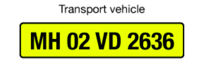

<h1 style="color:hotpink">OpenCV: Automatic License/Number Plate Recognition (ANPR) with Python</h1>

<h2> Objective: </h2>

A computer vision program to detect the number plate of the vehicles and extract registration number from the number plate. Also classify the type of car by analyzing the number plate into private, taxi and rented etc.

<h3> Private Vehicle </h3>

 The black letters in white background come under the private type. 

<h3>Transport Vehicle</h3>

 The black letters in the yellow background fall under taxi type 

<h3>Rented Vehicle </h3>

 The yellow letters in th black background fall under rented vehicle type.

<h3> Electric </h3>

The white letters in the green background fall under the electric vehicle 

